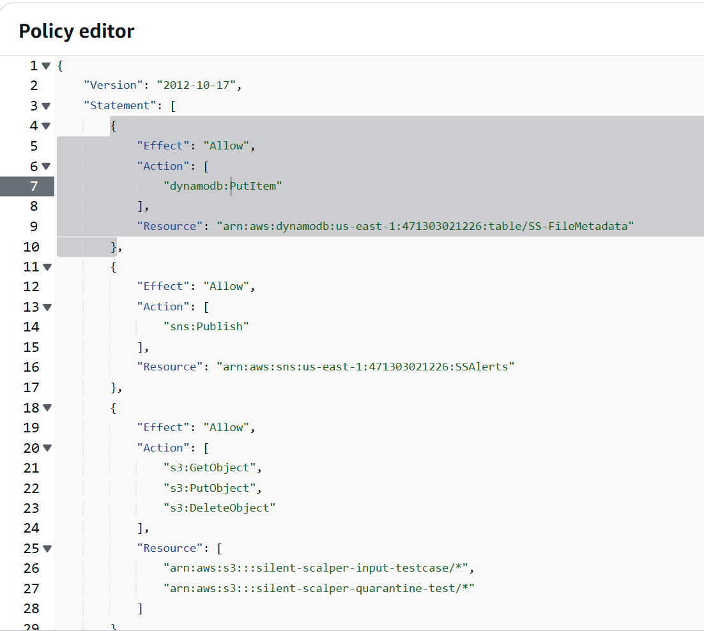
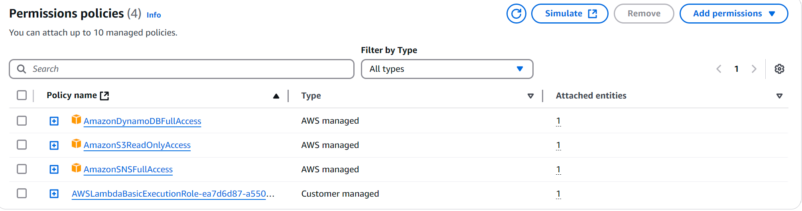
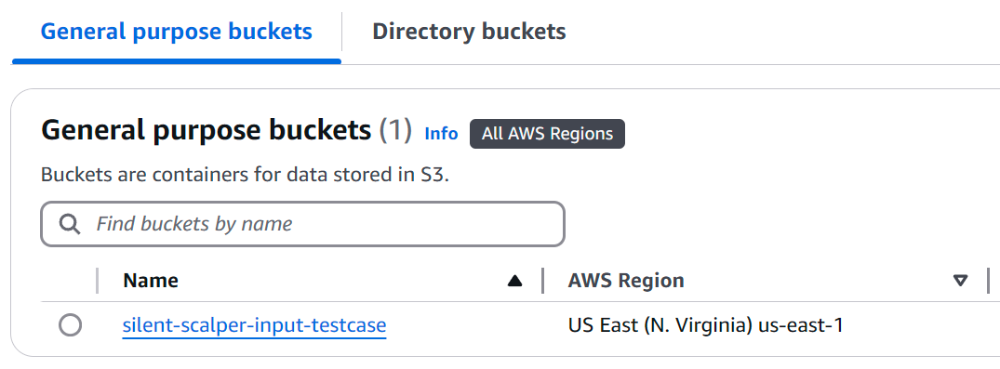
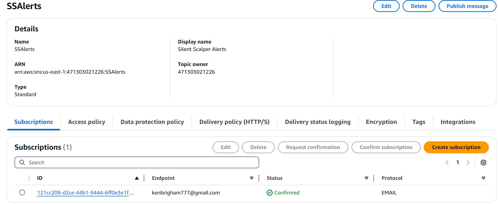
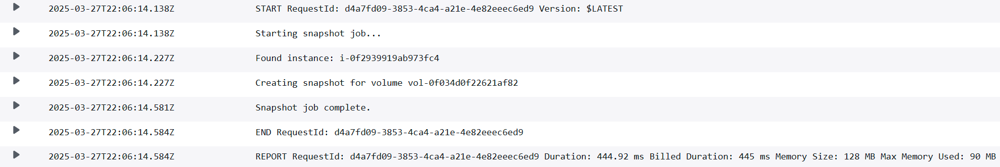
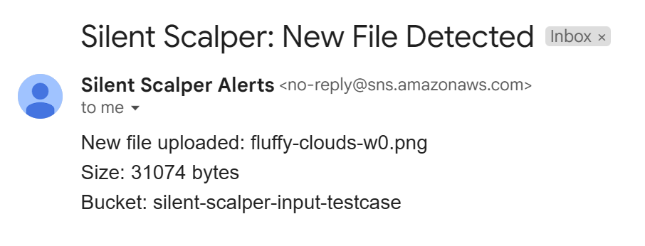
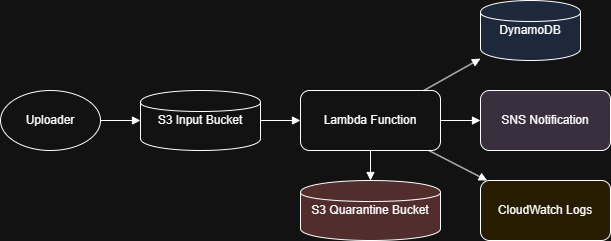

# Silent Scalper

## Project Summary

**Silent Scalper** is my first AWS project! After completing AWS Certified Cloud Practitioner and Certified Cloud Architect - Associate, I felt it was time to go more hands-on and get some practical experience working with these systems before continuing on the certification path. My Silent Scalper is a serverless data pipeline designed to solve two common problems in (inadequately architected) cloud-based systems:

-  **Wasting money on idle compute** (servers sitting idle when there’s no work to be done)
-  **Crashing during traffic spikes** (overloaded infrastructure from sudden file dumps)

This project uses AWS native services to create a responsive, cost-effective solution that automatically processes incoming files with no manual provisioning.

---

##  Architecture Overview

```
Uploader ──▶ S3 Bucket ──▶ Lambda Function
                                 │
                ┌────────────────┼────────────────┐
                ▼                ▼                ▼
           DynamoDB         SNS Notification   CloudWatch Logs
                │
                ▼
        Quarantine S3 Bucket (on failure)
```

---

##  Key Features

- ✅ Event-driven compute triggered on file upload
- ✅ Scales automatically — no idle infrastructure
- ✅ Writes file metadata to DynamoDB
- ✅ Sends real-time SNS alerts for success or failure
- ✅ Quarantines failed uploads to a separate S3 bucket
- ✅ CloudWatch logs for debugging and monitoring

---

##  Tech Stack

**AWS Services:**

- S3 (file upload + quarantine)
- Lambda (file processing)
- DynamoDB (metadata store)
- SNS (notifications)
- CloudWatch (logs + metrics)
- IAM (roles and permissions)

**Runtime:** Python 3.12 (AWS Lambda) - [Click here to see the full Python script used in this function](LambdaSSQB.py)

---

##  How It Works

1. A file is uploaded to the `silent-scalper-input-testcase` S3 bucket
2. S3 triggers a Lambda function
3. Lambda extracts metadata: filename, size, timestamp
4. The metadata is stored in a DynamoDB table (`SS-FileMetadata`)
5. An SNS topic (`SSAlerts`) sends a notification email
6. If an error occurs, the file is moved to a quarantine bucket (`silent-scalper-quarantine-test`)
7. Logs and alerts are published to CloudWatch

---

##  Security & Cost

- Entire project should fit within the AWS Free Tier:
  - ✅ 1M Lambda invocations/month
  - ✅ 5GB S3 storage
  - ✅ 25GB DynamoDB storage
  - ✅ 1M SNS publishes
  - ✅ 5GB CloudWatch logs
- IAM role for the Lambda function originally used managed policies (for the sake of simplicity) in this test case, but was made to follow a preferable least-privilege principle using an inline policy after confirming function. This is the policy used:



---

## Screenshots











---

## Reflections

This project was a hands-on exploration of real-world AWS architecture patterns. I primarily wanted to finally and actually build something in AWS, but I also wanted it to be practical in the real world - hence the two common issues targeted here: wasteful compute and fragile scaling. Silent Scalper uses serverless tools to build a lean, resilient, and automated system that handles high-volume file ingestion with ease.

Next features I plan to include:

- Adding automated retries from the quarantine bucket
- Integrating with a web dashboard for file tracking
- ~~Logging file types and processing durations for analytics~~ Added! See what was changed in Lambda [in this Python file](FileProcChanges.py).

---

##  Architecture Diagram




