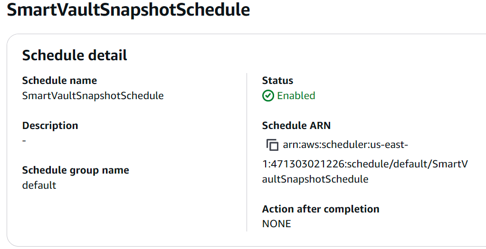
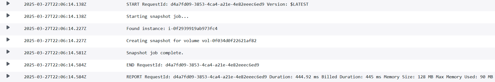

# Smart Vault: Automated EBS Backup System with DynamoDB logging

## Overview
My second project! This time I around I decided to create a **Smart Vault** - it's a serverless, tag-based backup automation system that creates and manages Amazon EBS snapshots for EC2 instances. It uses EventBridge to trigger AWS Lambda functions that:

- Create snapshots for tagged EC2 instances
- Store audit logs in DynamoDB
- Clean up expired snapshots based on customizable retention policies

The system is designed to minimize storage costs while providing traceable, automated protection for instance data.

---

## Architecture
**Core Components:**
- **EC2 + EBS**: Instances are tagged with `backup: true` to be included in the backup cycle
- **Lambda**: Two functions handle snapshot creation and cleanup
- **EventBridge**: Triggers Lambda on a daily schedule
- **DynamoDB**: Stores audit logs for snapshot deletions
- **CloudWatch Logs**: Captures job activity and debug output

### Diagram
```
+------------+     +---------------------+     +-------------------------+
| EC2 w/ Tag | --> | EventBridge Schedule| --> | Lambda: Create Snapshot |
+------------+     +---------------------+     +-------------------------+
                                                      |
                                                      v
                                               +-------------+
                                               | EBS Snapshot|
                                               +-------------+
                                                      |
+----------------+    +----------------------+          |
| EventBridge    | -> | Lambda: Cleanup      |----------+
| (daily)        |    | Old Snapshots        |          |
+----------------+    +----------------------+          v
                                               +------------------------+
                                               | DynamoDB Audit Log     |
                                               +------------------------+
```

---

## Features
- ✅ **Tag-Based Control**: Only instances tagged with `backup: true` are processed
- ✅ **Automated Scheduling**: Runs daily with EventBridge rules
- ✅ **Snapshot Tagging**: Snapshots include `InstanceId` and `CreatedBy: SmartVault`
- ✅ **Audit Logging**: Deletion records saved to DynamoDB
- ✅ **Retention Policy**: Configurable snapshot lifespan (default: 7 days)
- ✅ **Serverless + Free Tier Friendly**

---

## Tech Stack
- **AWS Lambda** (Python) - Check out the [Smart Vault backup function code here](Lambda SmartVault.py), and then the [Auto Cleanup/DynamoDB Audit function here](Lambda Cleanup Audit.py).
- **Amazon EC2 / EBS**
- **Amazon EventBridge**
- **Amazon DynamoDB**
- **AWS IAM (least privilege)**
- **CloudWatch Logs**

---

## Screenshots








---

## Future Improvements
-  Notification system via SNS
-  Web UI for audit log visualization
-  Snapshot restore utility
-  EC2 volume-to-S3 archival (long term)

---

