Thanks for visiting my portfolio! What will follow is a rough outline of the various aspects of my hands-on learning & experience in the realm of cyberecurity - this **is not meant to be comprehensive**, but rather to highlight & quantify some of the tangible skills and techniques that I've practiced. 
I currently hold, among others, active Security+ and Network+ certifications from CompTIA (which hopefully verify at least some level of foundational knowledge), so the projects here will likely be more technical and role-specific as opposed to generalized knowledge. 


# TryHackMe - SOC Level 1


The first role-specific labs I'll be documenting will come from TryHackMe's SOC Level 1 learning path & certificate! 

## Module 1. Intro

Right off the bat and from the very first module, they have us using a simplified, mock SIEM to identify a malicious connection attempt, use a mock open-source IP address database to determine if the IP is known to be malicious, escalate the alert to the correct team member (in this case, the SOC Team Lead) and then block the IP address in the firewall once given permission to do so.

See photos below:

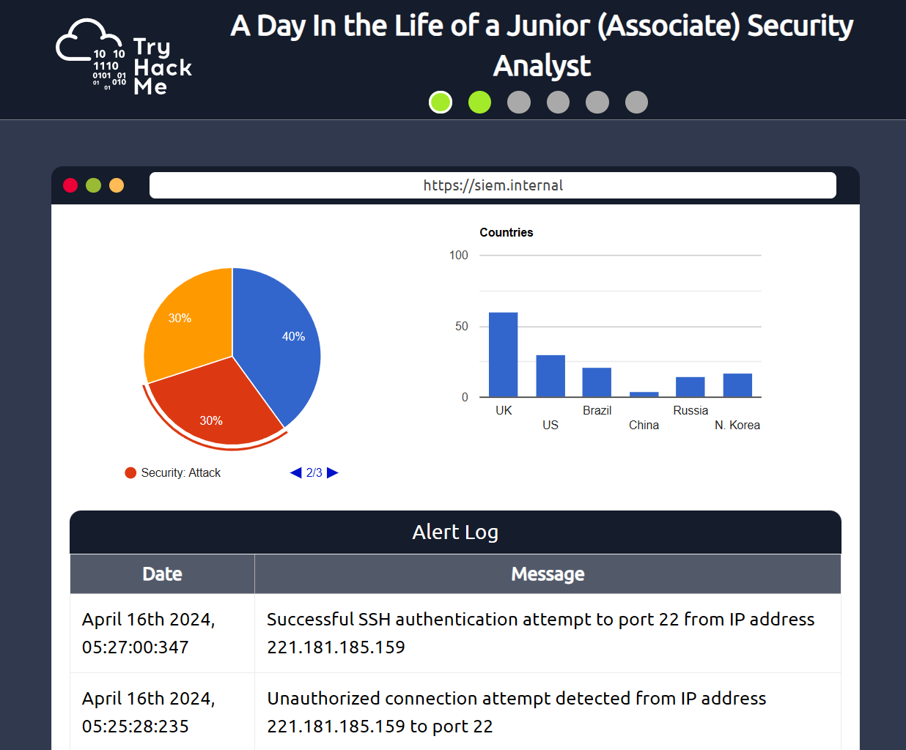

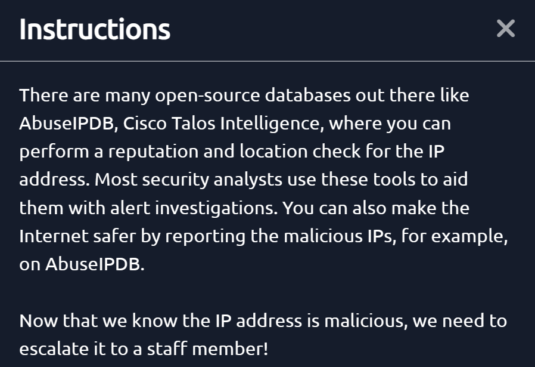

And the questions + answers:

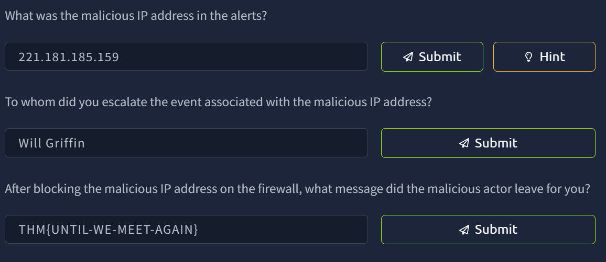


## Module 2. Pyramid of Pain

Next up is the Pyramid of Pain - this is essentially a framework that demonstrates how certain IoCs are more troubling to a threat actor than another, and is used to enhance Cyber Threat Intelligence (CTI) in many cybersecurity solutions. From AttackIQ: "The Pyramid of Pain ... provides an ascending priority list of indicators against which security controls should be applied." So, starting from the bottom and working up:

### Trivial - Hash Values

Hash values are exceptionally easy for a threat actor to circumvent, as modifying a file by even a single bit and then recompiling will produce a different hash and therefore entirely sidestep an attempted control at this level. See below for given example:

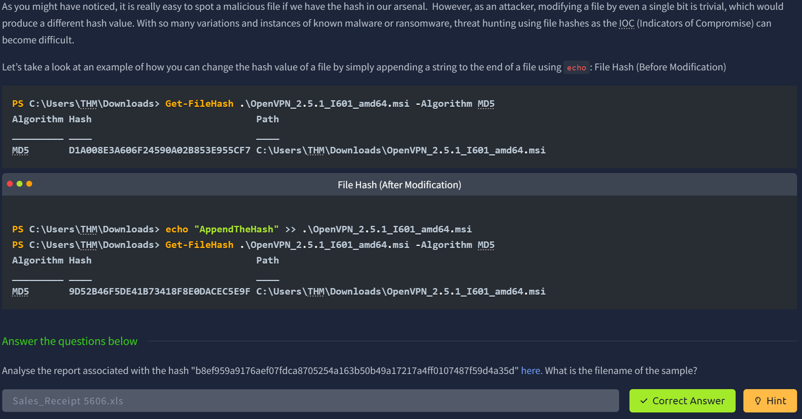

### Easy - IP Address

IP addresses are also quite easy for even less experienced adversaries to work around. Blocking or denying inbound traffic/requests from a given IP is not a bulletproof defense, despite being a common (and still useful) defense tactic. We are then given an example of how threat actors can work around a control at this level, and provided static reports from [any.run](https://any.run/) to analyze and then answer the following:

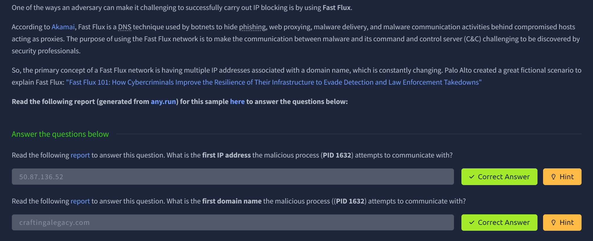

### Simple - Domain Names

Moving up the Pyramid once again, we have domain names. Direct from THM: "Domain Names can be a little more of a pain for the attacker to change as they would most likely need to purchase the domain, register it and modify DNS records. Unfortunately for defenders, many DNS providers have loose standards and provide APIs to make it even easier for the attacker to change the domain."


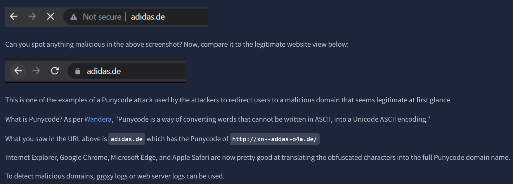

The module goes on to explain the use of URL shorteners, and how they are commonly used to hide malicious domain names, and provides a potential negation tactic in appending a '+' to the shortened URL to see the full domain you are being directed to. For example, "http://bit.ly/275hf9**+**" would show the actual destination of that link. Next, we circle back to the ever-so-useful any.run. Being a sandboxing service that executes a sample, it allows us to review connections such as HTTP or DNS requests, or see any processes attempting to communicate with an external IP. 

Finally, we're given an actual sandboxed file on AnyRun, and asked to answer the following questions by analzying the information in the pictured report:

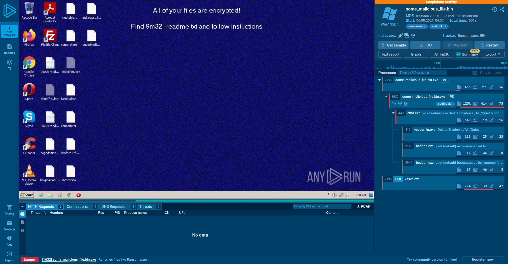


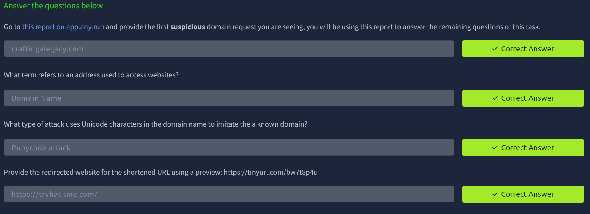

### Annoying - Host Artifacts

Moving up another step into the 'yellow zone', we have host artifacts. This is where the attacker will begin to feel much more frustrated if the attack is detected as it would likely require them to change their tools and methodologies, which can be very time consuming.

From THM: "Host artifacts are the traces or observables that attackers leave on the system, such as registry values, suspicious process execution[s], attack patterns or IOCs (Indicators of Compromise), files dropped by malicious applications, or anything exclusive to the current threat."

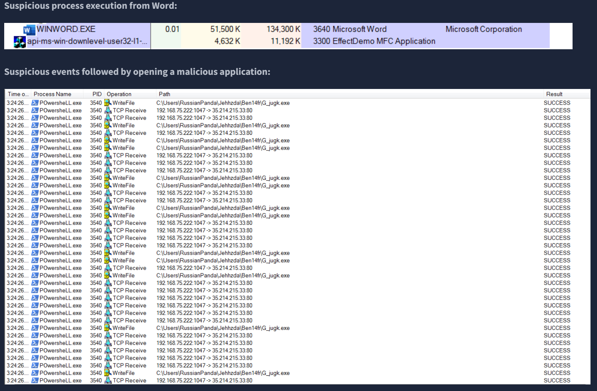

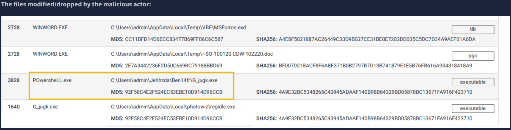

We are then given an [example malware analysis report](https://assets.tryhackme.com/additional/pyramidofpain/task5-report.pdf), and asked to answer several questions based on the information within it:

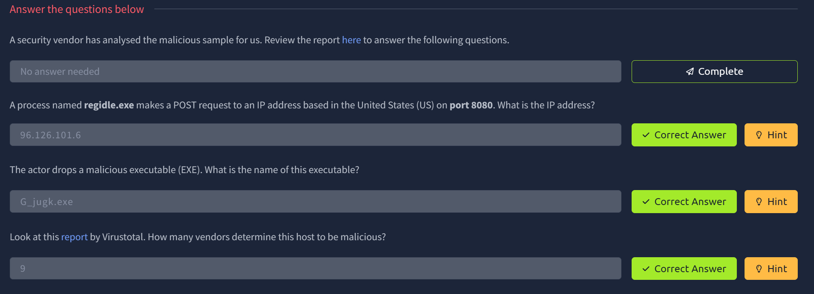

### Annoying - Network Artifacts

In the same 'yellow zone' as Host Artifacts are Network Artifacts. Again from THM: "A network artifact can be a user-agent string, C2 information, or URI patterns followed by the HTTP POST requests. An attacker might use a User-Agent string that hasn’t been observed in your environment before or seems out of the ordinary. The User-Agent is defined by RFC2616 as the request-header field that contains the information about the user agent originating the request."

We're given some background and explanations here, as well as the first mention of our dearly beloved Wireshark!

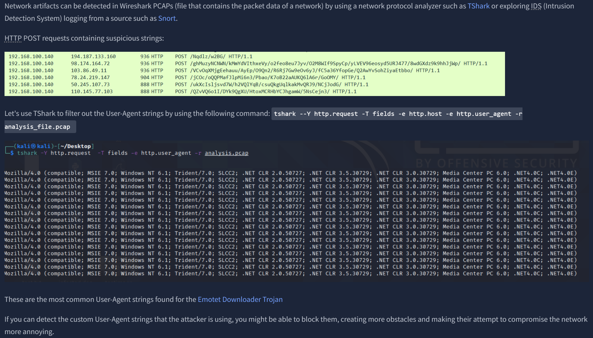

Then some questions regarding the above screenshots:

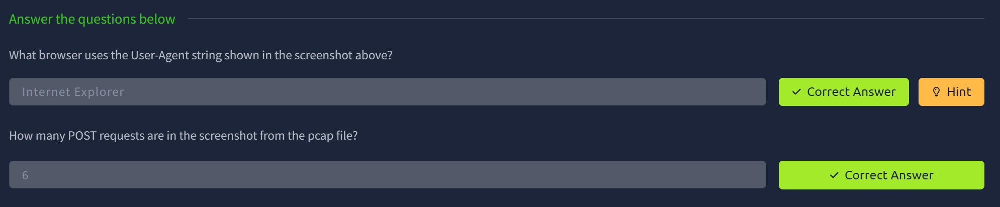

### Challenging - Tools

At this point in the Pyramid, an attacker will likely give up, or if they're sufficiently advanced and/or committed, will at least have to go back to the drawing board and create a new tool that serves the same purpose. Threat actors without sufficient resources to continue will often be deflected at this point.

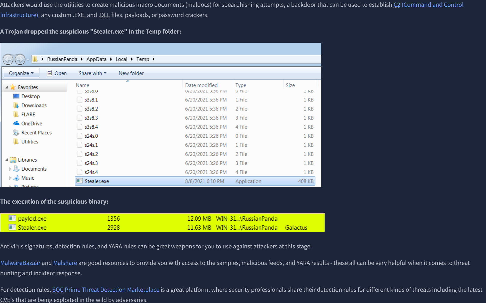

We get a description of fuzzy hashing and similarity analysis, as well as some info on SSDEEP and an example report from VirusTotal which highlights the SSDEEP. Some questions follow, which mostly involve SSDEEP's official website and their descriptions of terminology within.

### Tough - TTPs

We finally reach the apex of the Pyramid of Pain, where we have Tactics, Techniques & Procedures. We get our first mention of the omnipresent MITRE ATT&CK Matrix, which is a framework that lists, essentially, all the steps taken by a cyber adversary to achieve their goal in almost any possible circumstance. By detecting and responding to TTPs quickly, we leave the threat actor almost no chance to fight back.

The questions we are given primarily relate to navigating and finding specific information within the ATT&CK framework, which has become something of a part-time job for me at this point! The edutainment on offer is truly bottomless.


### Pyramid of Pain - Practical

The practical involves matching descriptions to each 'block' of the Pyramid, then entering the flag awarded for doing so.

### Pyramid of Pain - Conclusion

We finished the module!

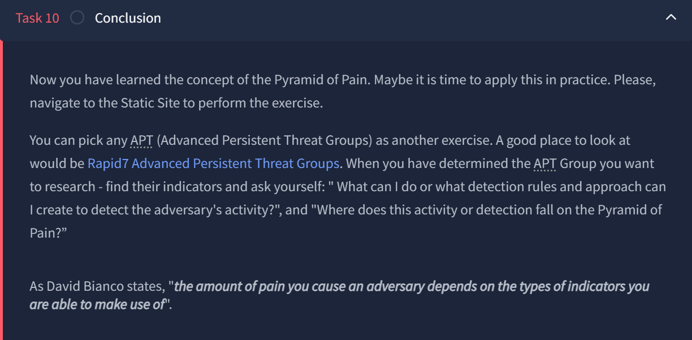

## Module 3 - Cyber Kill Chain

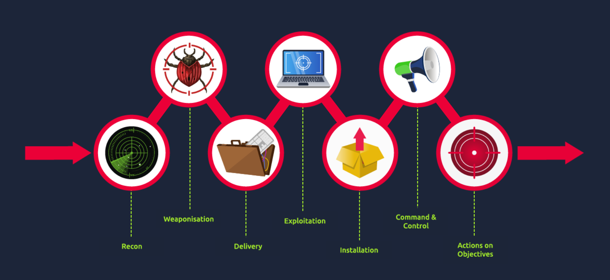

Moving on to the next module - Cyber Kill Chain! In the words of THM:

"The term kill chain is a military concept related to the structure of an attack. It consists of target identification, decision and order to attack the target, and finally the target destruction.

Thanks to Lockheed Martin, a global security and aerospace company, that established the Cyber Kill Chain® framework for the cybersecurity industry in 2011 based on the military concept. The framework defines the steps used by adversaries or malicious actors in cyberspace. To succeed, an adversary needs to go through all phases of the Kill Chain. We will go through the attack phases and help you better understand adversaries and their techniques used in the attack to defend yourself.

So, why is it important to understand how Cyber Kill Chain works? 

The Cyber Kill Chain will help you understand and protect against ransomware attacks, security breaches as well as Advanced Persistent Threats (APTs). You can use the Cyber Kill Chain to assess your network and system security by identifying missing security controls and closing certain security gaps based on your company's infrastructure.

By understanding the Kill Chain as a SOC Analyst, Security Researcher, Threat Hunter, or Incident Responder, you will be able to recognize the intrusion attempts and understand the intruder's goals and objectives. 

We will be exploring the following attack phases in this room:

1. Reconnaissance
2. Weaponization
3. Delivery
4. Exploitation
5. Installation
6. Command & Control
7. Actions on Objectives 

Learning Objectives: In this room, you will learn about each phase of the Cyber Kill Chain Framework, the advantages and disadvantages of the traditional Cyber Kill Chain. 

Outcome: As a result, you will be ready to recognize different phases or stages of the attack carried out by an adversary and be able to break the "kill chain.""

### Reconnaissance 

The topic of OSINT is introduced, and specifically email harvesting is focused on with various examples of tools used, such as [theHarvester](https://github.com/laramies/theHarvester) here on Github.

### Weaponization

After a succesful reconnaissance stage, the threat actor will combine **malware** and **exploit(s)** into a deliverable **payload**. Malware may be custom-written by threat actors with access to more advanced resources, or can be software-generated or simply purchased on dark web markets. Per THM:

"**Malware** is a program or software that is designed to damage, disrupt, or gain unauthorized access to a computer.

An **exploit** is a program or a code that takes advantage of the vulnerability or flaw in the application or system.

A **payload** is a malicious code that the attacker runs on the system."

### Delivery

Delivery is when the threat actor decides on the method for distributing their payload or malware. Common options include phishing emails, distributing infected USB drives (with various degrees of sophistication) and watering hole attacks, but there are many more that exist besides these.

### Exploitation 

To gain access to a system, the attacker must then exploit the vulnerability. The concept of lateral movement is introduced and defined, as well as the first mention of the OWASP TOP 10 and the link to a TryHackMe room in which all 10 are discussed and exploited in real-time labs (will do and document this at a later date). Zero-day exploits are also introduced and talked about.

### Installation

Per THM: "Once the attacker gets access to the system, he would want to reaccess the system if he loses connection to it or if he gets detected and has the initial access removed, or if the system is later patched. That is when the attacker needs to install a persistent backdoor. A persistent backdoor will let the attacker access the system he compromised in the past."

Persistence can be achieved through web shells, installed backdoors via programs such as Meterpreter, [creating/modifying Windows services](https://attack.mitre.org/techniques/T1543/003/), or by adding the entry to the "run keys" for the malicious payload in the Registry or the Startup folder. In this phase, the attacker can also use the [Timestomping](https://attack.mitre.org/techniques/T1070/006/) technique to avoid detection by the forensic investigator and also to make the malware appear as a part of a legitimate program. The Timestomping technique lets an attacker modify the file's timestamps, including the modify, access, create and change times. 

### Command & Control (C2)

After gaining persistence and executing the malware on the target machine, the attacker can open a C2 channel through the malware to remotely control and manipulate the victim. This is also written as C&C or C2 Beaconing, and is a type of malicious communication between a C2 server and the malware on an infected host. The compromised endpoint would communicate with an external server set up by the attacker to establish a command & control channel. After establishing this connection, the attacker gains full control of the victim's machine. THM:

"The most common C2 channels used by adversaries nowadays:

The protocols HTTP on port 80 and HTTPS on port 443 - this type of beaconing blends the malicious traffic with the legitimate traffic and can help the attacker evade firewalls.  
DNS (Domain Name Server). The infected machine makes constant DNS requests to the DNS server that belongs to an attacker, this type of C2 communication is also known as DNS Tunneling.
[it is] important to note that [either] an adversary or another compromised host can be the owner of the C2 infrastructure."

### Actions on Objectives (Exfiltration)

After going through the previous 6 phases of the attack, the attacker can finally achieve their goals, which means taking action on their original objectives. With hands-on keyboard access, the attacker can achieve the following: 

*  Collect the credentials from users.
*  Perform privilege escalation (gaining elevated access like domain administrator access from a workstation by exploiting the misconfiguration).
*  Internal reconnaissance (for example, an attacker gets to interact with internal software to find its vulnerabilities).
*  Lateral movement through the company's environment.
*  Collect and exfiltrate sensitive data.
*  Deleting the backups and shadow copies. Shadow Copy is a Microsoft technology that can create backup copies, snapshots of computer files, or volumes. 
*  Overwrite or corrupt data.

### Cyber Kill Chain - Practical

Similar to the previous practical, we are required to match general concepts to the different stages of the Chain.

### Cyber Kill Chain - Conclusion

We have finished the module! THM offers some closing thoughts on the CKC - see below.

!(CKC Conclusion)[THM Mod 3 - CKC Conclusion.png]


Text can be **bold**, _italic_, ~~strikethrough~~ or `keyword`.

[Link to another page](./another-page.html).

There should be whitespace between paragraphs.

There should be whitespace between paragraphs. We recommend including a README, or a file with information about your project.

# Header 1

This is a normal paragraph following a header. GitHub is a code hosting platform for version control and collaboration. It lets you and others work together on projects from anywhere.

## Header 2

> This is a blockquote following a header.
>
> When something is important enough, you do it even if the odds are not in your favor.

### Header 3

```js
// Javascript code with syntax highlighting.
var fun = function lang(l) {
  dateformat.i18n = require('./lang/' + l)
  return true;
}
```

```ruby
# Ruby code with syntax highlighting
GitHubPages::Dependencies.gems.each do |gem, version|
  s.add_dependency(gem, "= #{version}")
end
```

#### Header 4

*   This is an unordered list following a header.
*   This is an unordered list following a header.
*   This is an unordered list following a header.

##### Header 5

1.  This is an ordered list following a header.
2.  This is an ordered list following a header.
3.  This is an ordered list following a header.

###### Header 6

| head1        | head two          | three |
|:-------------|:------------------|:------|
| ok           | good swedish fish | nice  |
| out of stock | good and plenty   | nice  |
| ok           | good `oreos`      | hmm   |
| ok           | good `zoute` drop | yumm  |

### There's a horizontal rule below this.

* * *

### Here is an unordered list:

*   Item foo
*   Item bar
*   Item baz
*   Item zip

### And an ordered list:

1.  Item one
1.  Item two
1.  Item three
1.  Item four

### And a nested list:

- level 1 item
  - level 2 item
  - level 2 item
    - level 3 item
    - level 3 item
- level 1 item
  - level 2 item
  - level 2 item
  - level 2 item
- level 1 item
  - level 2 item
  - level 2 item
- level 1 item

### Small image


### Large image


### Definition lists can be used with HTML syntax.

<dl>
<dt>Name</dt>
<dd>Godzilla</dd>
<dt>Born</dt>
<dd>1952</dd>
<dt>Birthplace</dt>
<dd>Japan</dd>
<dt>Color</dt>
<dd>Green</dd>
</dl>

```
Long, single-line code blocks should not wrap. They should horizontally scroll if they are too long. This line should be long enough to demonstrate this.
```

```
The final element.
```
